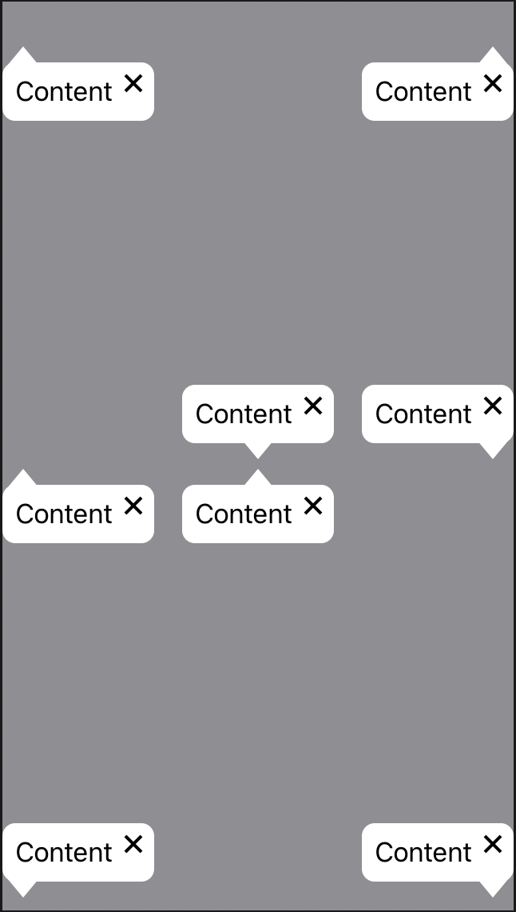
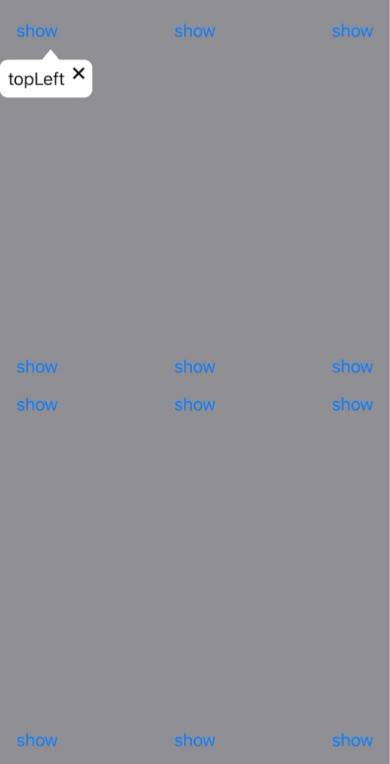

# SComponents

[](http://cocoadocs.org/docsets/SComponents/)
[](https://github.com/shial4/SComponents)
[](https://swift.org/package-manager/)
[](https://developer.apple.com/documentation/xcode/creating_a_mac_version_of_your_ipad_app/)

Native SwiftUI components 

## 🐥 Features

- [🐥] Popover
- [] Aler
- [] Modal

## 💊 How To Use

### Popover
<div style="float:left;margin:0 10px 10px 0" markdown="1">
  
  
</div>

You specify the content of a popover using a SwiftUI views extension method.

```swift
import SComponents

Text("My App content")
    .popover(isShowing: .constant(true)) {
        Text("popover content")
    }
```

Above example shows how to present a popover from a SwiftUI `view`, which acts as the anchor rect for the popover  and floats above the main window.
Popover uses the center position of that item to determine where to place and how to orient its arrow. 
Use popovers for app content that appears when needed and disappears when the user is finished with it. Pass your SwiftUI flag as binding under `isShowing` in order to show/hide popover.
For example, you can use popovers to display information about the currently selected item, to display tools and configuration options, or to gather information from the user.  

## 🔧 Installation

There are four ways to use SComponents in your project:
- using CocoaPods
- using Carthage
- using Swift Package Manager
- manual install (build frameworks or embed Xcode Project)

### Installation with CocoaPods

[CocoaPods](http://cocoapods.org/) is a dependency manager for Objective-C, which automates and simplifies the process of using 3rd-party libraries in your projects. See the [Get Started](http://cocoapods.org/#get_started) section for more details.

#### Podfile

```
platform :ios, '13.0'
pod 'SComponents'
```

##### Swift and static framework

Swift project previously had to use `use_frameworks!` to make all Pods into dynamic framework to let CocoaPods work.

However, starting with `CocoaPods 1.5.0+` (with `Xcode 9+`), which supports to build both Objective-C && Swift code into static framework. You can use modular headers to use SComponents as static framework, without the need of `use_frameworks!`:

```
platform :ios, '13.0'
# Uncomment the next line when you want all Pods as static framework
# use_modular_headers!
pod 'SComponents', :modular_headers => true
```

See more on [CocoaPods 1.5.0 — Swift Static Libraries](http://blog.cocoapods.org/CocoaPods-1.5.0/)

If not, you still need to add `use_frameworks!` to use SComponents as dynamic framework:

```
platform :ios, '13.0'
use_frameworks!
pod 'SComponents'
```

### Installation with Carthage

[Carthage](https://github.com/Carthage/Carthage) is a lightweight dependency manager for Swift and Objective-C. It leverages CocoaTouch modules and is less invasive than CocoaPods.

To install with carthage, follow the instruction on [Carthage](https://github.com/Carthage/Carthage)

Carthage users can point to this repository and use  generated framework

Make the following entry in your Cartfile: `github "SComponents/SComponents"`
Then run `carthage update`
If this is your first time using Carthage in the project, you'll need to go through some additional steps as explained [over at Carthage](https://github.com/Carthage/Carthage#adding-frameworks-to-an-application).

### Installation with Swift Package Manager 

[Swift Package Manager](https://swift.org/package-manager/) (SwiftPM) is a tool for managing the distribution of Swift code as well as C-family dependency. 

Click `File` -> `Swift Packages` -> `Add Package Dependency`, enter [SComponents repo's URL](https://github.com/shial4/SComponents.git). Or you can login Xcode with your GitHub account and just type `SComponents` to search.

After select the package, you can choose the dependency type (tagged version, branch or commit). Then Xcode will setup all the stuff for you.

If you're a framework author and use SComponents as a dependency, update your `Package.swift` file:

```swift
let package = Package(
    dependencies: [
        .package(url: "https://github.com/shial4/SComponents.git", from: "0.0.1")
    ],
    //...
)
```

## ⭐ Contributing

Be welcome to contribute to this project! :)

## ❓ Questions

Just create an issue on GitHub.

## 📝 License

This project was released under the [MIT](LICENSE) license.
